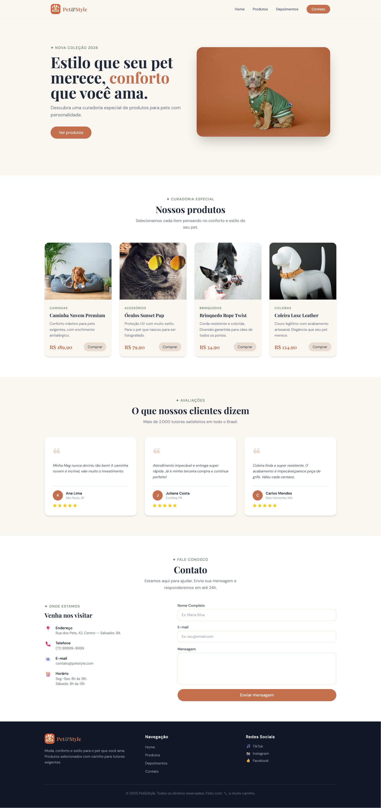

# 🐾 Pet&Style — Loja Virtual

> Página inicial de uma loja fictícia especializada em produtos com estilo para pets.  
> Projeto desenvolvido como atividade prática do curso de Front-End.

---

## 📸 Preview

<!-- Substitua pelo link da imagem após subir no GitHub -->


---

## 🚀 Tecnologias utilizadas

- **HTML5** semântico (`section`, `nav`, `figure`, `blockquote`, `figcaption`, `form`)
- **Tailwind CSS** via CDN com configuração customizada de design system
- **Google Fonts** — Playfair Display + DM Sans
- **JavaScript** vanilla para o menu mobile (hamburguer)

---

## 📐 Funcionalidades

- ✅ Layout **responsivo** com estratégia **mobile-first**
- ✅ **Header fixo** com menu de navegação e hamburguer para mobile
- ✅ **Hero** com chamada principal, CTA e imagem de destaque
- ✅ **Seção de Produtos** com CSS Grid (1 → 2 → 4 colunas por breakpoint)
- ✅ **Cards de produto** com efeito de zoom na imagem via `group-hover`
- ✅ **Depoimentos** com semântica correta (`figure` + `blockquote` + `figcaption`)
- ✅ **Formulário de contato** acessível com `label` vinculado a cada `input`
- ✅ **Footer** com 3 colunas e links de navegação e redes sociais

---

## 🎨 Design System

| Token | Valor | Uso |
|---|---|---|
| `terracota` | `#c4704f` | Cor primária, CTAs, destaques |
| `musgo` | `#5c7a5e` | Cor secundária, categorias, eyebrow text |
| `creme` | `#faf6f1` | Fundo principal, navbar |
| `areia` | `#e8ddd0` | Fundos suaves, bordas, aspas decorativas |

**Tipografia:**
- `font-display` → Playfair Display (títulos e preços)
- `font-body` → DM Sans (textos e navegação)

---

## 📁 Estrutura do projeto

```
petstyle-loja-virtual/
├── index.html
├── README.md
├── logo.png
└── img/
    ├── dog_style.jpg
    ├── caminha.jpg
    ├── oculos.jpg
    ├── corda.jpg
    └── coleira.jpg
```

---

## 💻 Como visualizar

1. Clone o repositório:
```bash
git clone https://github.com/lucassloliveira/petstyle.git
```

2. Abra o arquivo `index.html` diretamente no navegador.

> Não é necessário instalar nada — o Tailwind é carregado via CDN.

---

## 📚 Conceitos aplicados

- **Mobile-first** com breakpoints `sm:`, `md:`, `lg:`
- **Flexbox** para navbar, hero e seção de contato
- **CSS Grid** para cards de produto e depoimentos
- **group / group-hover** para microinterações nos cards
- **Acessibilidade (a11y)**: `aria-label`, `aria-hidden`, `label for`, `sr-only`
- **Semântica HTML**: uso correto de `figure`, `blockquote`, `figcaption`, `nav`, `header`, `footer`

---

## 👨‍💻 Autor

Desenvolvido por **Lucas Sousa**  
Curso de Front-End — EBAC  
